# 🩺 DermaAI – AI-Powered Skin Disease Detection System

<p align="center">
  <strong>AI-Assisted Skin Analysis for Smarter Dermatology Support</strong>
</p>

<p align="center">
  DermaAI is a web-based AI-powered skin disease detection system designed to help users analyze skin images, view prediction results, explore skin-condition information, manage prediction history, read health-related blogs, and locate dermatologists.
</p>

---

## 📌 Project Overview

**DermaAI** is a Final Year Project focused on applying Artificial Intelligence and Deep Learning to preliminary skin-condition analysis.

The system allows a user to upload a skin image and receive an AI-generated prediction. Along with the prediction workflow, DermaAI provides a complete web experience including user authentication, a personal dashboard, prediction history, a skin-condition information library, blogs, and a dermatologist locator.

The goal is to make AI-assisted skin analysis easier to access through a clean and user-friendly web interface.

> **Medical Disclaimer:** DermaAI is an academic/project-based AI assistance system. Its predictions are not a medical diagnosis and should not replace consultation with a qualified dermatologist or healthcare professional.

---

# ✨ Key Features

### 🤖 AI Skin Disease Detection
- Upload a skin image for AI-assisted analysis.
- Deep-learning-based prediction workflow.
- Displays the predicted skin condition through a dedicated result interface.

### 👤 User Authentication
- User registration
- User login
- Email verification
- Protected user experience

### 📊 User Dashboard
- Personal dashboard
- Uploaded-image and prediction history
- Easy access to previous analyses

### 📚 Skin Condition Library
- Information about supported skin conditions
- Dedicated condition information interface
- Educational content to help users understand different conditions

### 🧑‍⚕️ Dermatologist Locator
- Dedicated dermatologist-finding page
- Helps users move from AI-assisted analysis toward professional medical consultation

### 📰 Health & Awareness Blogs
- Blog listing interface
- Blog details pages
- Educational and awareness-focused content

### 📱 Responsive Web Interface
- Modern web UI
- Structured navigation
- User-friendly pages and sections

### ❌ Error Handling
- Custom 404 / Not Found page
- Dedicated UI states for different application flows

---

# 🧠 Artificial Intelligence & Machine Learning

DermaAI uses a deep-learning-based image classification approach for skin-condition prediction.

### Model

**MobileNetV2** is used as the deep learning model for image classification.

### Frameworks

- TensorFlow
- Keras
- Python

### Dataset

The project uses the **HAM10000 (Human Against Machine with 10000 training images)** dataset as the primary dataset for skin-lesion image classification.

### Image Processing

The prediction pipeline processes the uploaded image into the required model input format before passing it through the trained model.

The system then maps the model output to the corresponding skin-condition information presented to the user.

---

# 🛠️ Technologies Used

## Frontend

- React.js
- Vite
- JavaScript
- HTML5
- CSS3
- React Router

## Backend

- Python
- FastAPI

## Database

- MongoDB / MongoDB Atlas

## AI / Machine Learning

- Python
- TensorFlow
- Keras
- MobileNetV2
- HAM10000 Dataset

## Supporting Technologies

- REST API architecture
- Image processing
- Authentication
- Email verification
- Map-based dermatologist location functionality

---

# 🔄 How DermaAI Works

```text
                 ┌──────────────────────┐
                 │        User          │
                 └──────────┬───────────┘
                            │
                            ▼
                 ┌──────────────────────┐
                 │ Upload Skin Image    │
                 └──────────┬───────────┘
                            │
                            ▼
                 ┌──────────────────────┐
                 │ Image Preprocessing  │
                 └──────────┬───────────┘
                            │
                            ▼
                 ┌──────────────────────┐
                 │   MobileNetV2 Model  │
                 └──────────┬───────────┘
                            │
                            ▼
                 ┌──────────────────────┐
                 │ Prediction Result    │
                 └──────────┬───────────┘
                            │
                ┌───────────┴────────────┐
                ▼                        ▼
       ┌─────────────────┐      ┌──────────────────┐
       │ Prediction      │      │ Professional     │
       │ History         │      │ Dermatologist    │
       └─────────────────┘      │ Consultation     │
                                └──────────────────┘
```

---

# 📸 Project Screenshots

The following screenshots are taken from the actual DermaAI user interface and are included in the repository's `Screenshots` folder.

> **Note:** Keep the filenames and extensions exactly as shown below so that the images render correctly on GitHub.

---

## 🏠 Home Page – Main Section

The main landing section introduces DermaAI and its AI-assisted skin analysis experience.

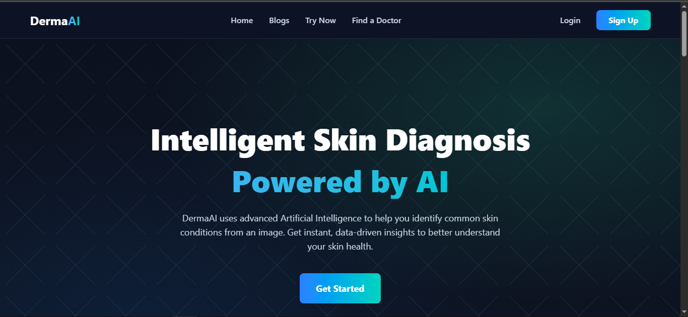

---

## ⚙️ Home Page – How It Works

This section explains the basic workflow of using DermaAI.

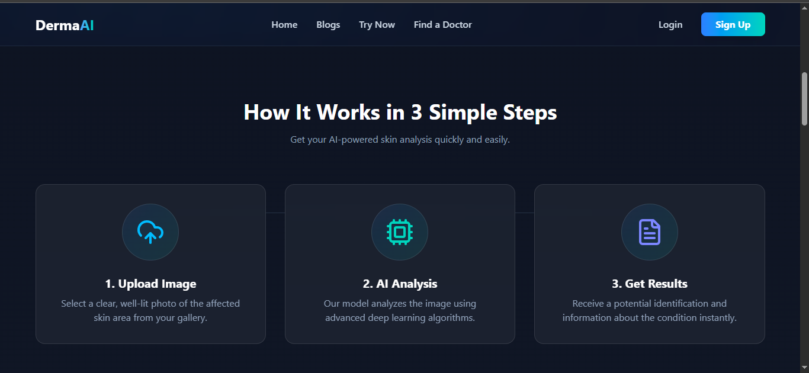

---

## 🔬 Home Page – Conditions We Analyze

This section presents the skin conditions supported by the system.

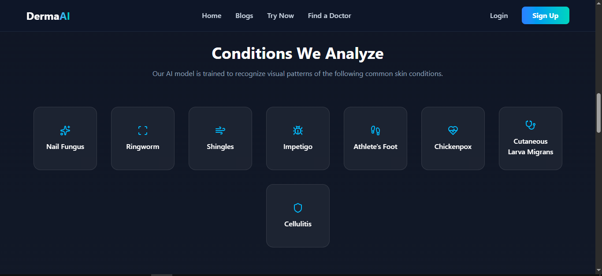

---

## 📩 Home Page – Contact Form

The contact section provides a way for users to communicate through the application interface.

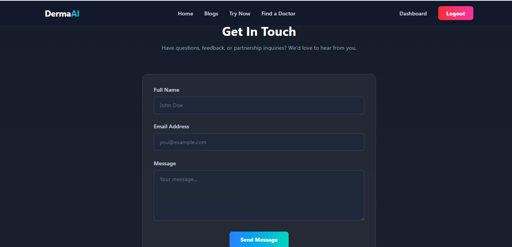

---

## 🧾 Footer Section

The footer provides additional navigation and project information.

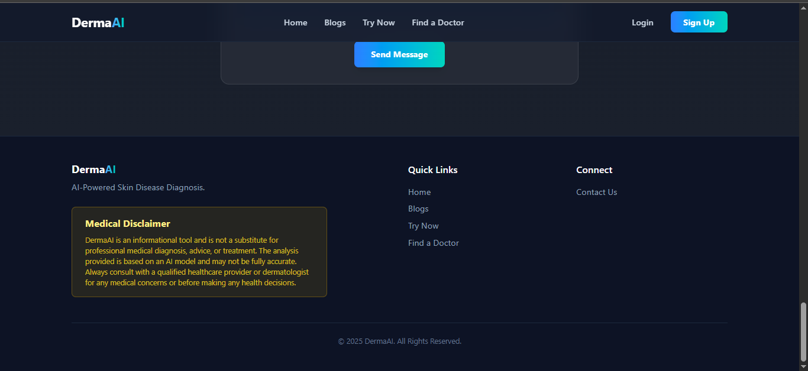

---

## 👤 User Signup Page

New users can create an account through the registration interface.

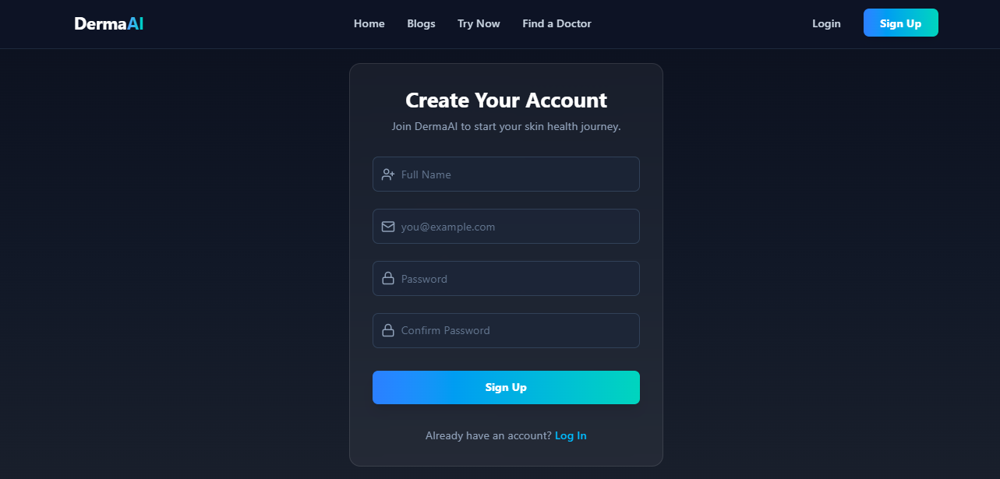

---

## 🔐 User Login Page

Registered users can access their account through the login interface.

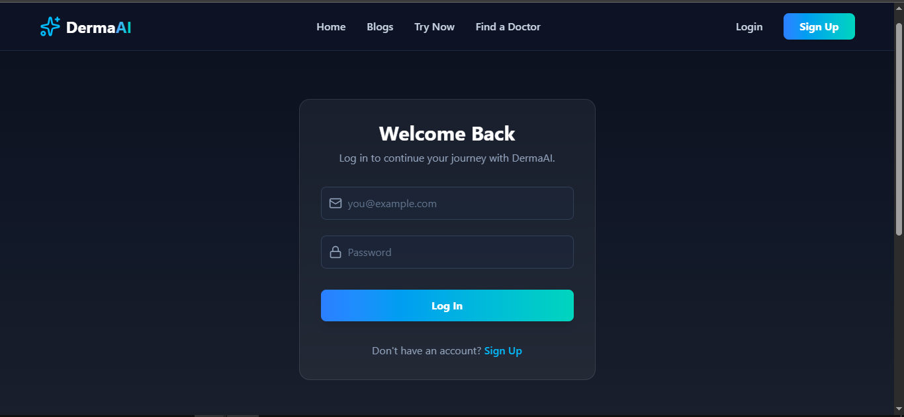

---

## ✉️ Email Verification Page

The application provides an email-verification workflow for account verification.

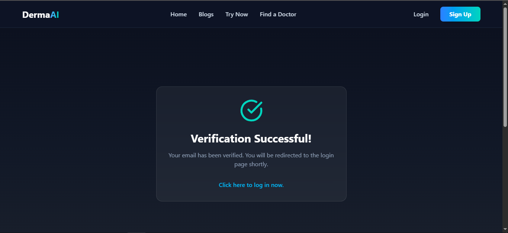

---

## 📊 User Dashboard – Image Upload & Prediction History

The dashboard provides users with access to image analysis and previous prediction history.

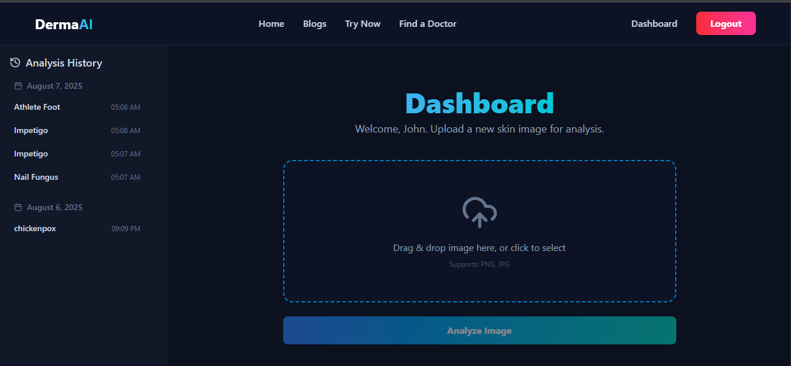

---

## 🧪 Guest Analysis Page

The guest analysis interface allows users to access the skin-analysis experience without the complete authenticated dashboard workflow.

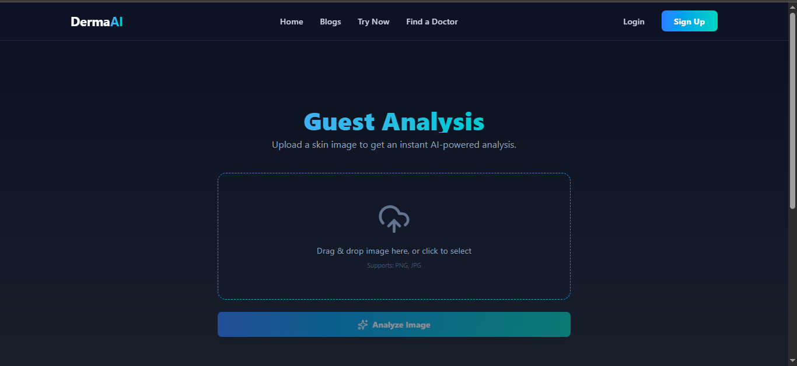

---

## 🧠 Prediction Result Display

After analysis, the system displays the AI-generated prediction result.

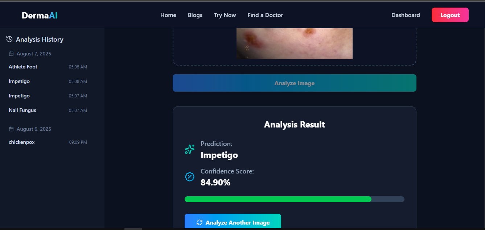

---

## 🧑‍⚕️ Dermatologist Locator Page

Users can access the dermatologist locator to move toward professional consultation.

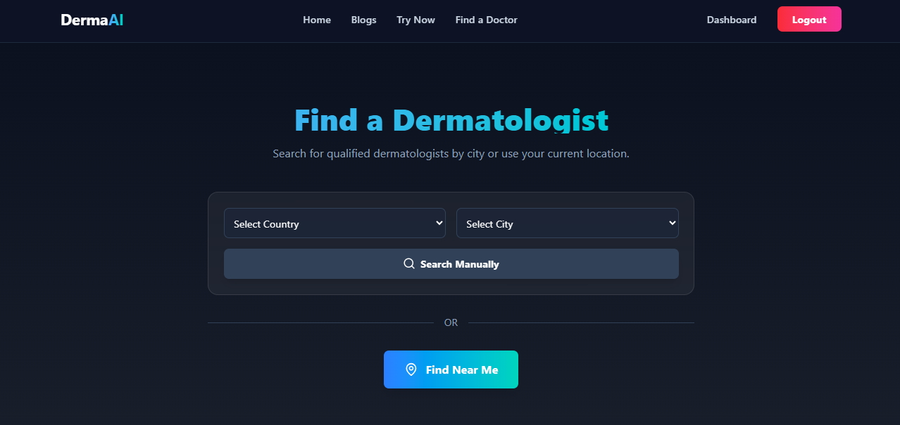

---

## 📰 Blog Listing Page

The blog section provides health and skin-awareness content.

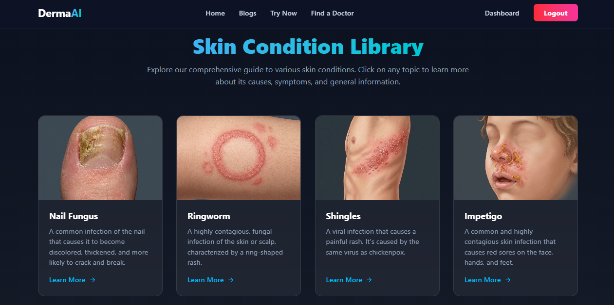

---

## ❌ 404 Not Found Page

DermaAI includes a custom page for unavailable routes.

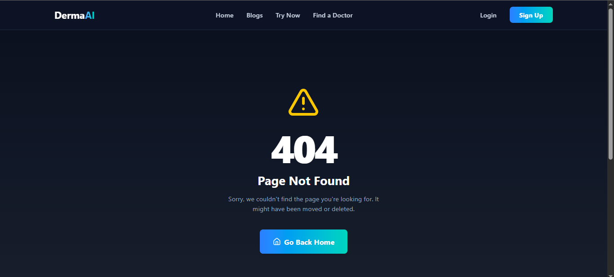

---

# 📂 Project Structure

```text
DermaAI/
│
├── Backend/
│   ├── app/
│   │   ├── api/
│   │   ├── services/
│   │   └── utils/
│   ├── requirements.txt
│   └── ...
│
├── Frontend/
│   └── derma-ai/
│       ├── public/
│       ├── src/
│       ├── package.json
│       └── ...
│
├── Model Training/
│   └── ...
│
├── Screenshots/
│   ├── 404-Not-Found-Page.png
│   ├── Blog-Listing-Page.png
│   ├── Dermatologist-Locator-Page.png
│   ├── Email-Verification-Page.png
│   ├── Footer-Section.png
│   ├── Guest-Analysis-Page.png
│   ├── Home-Page-Conditions-We-Analyze-Section.png
│   ├── Home-Page-Contact-Form-Section.png
│   ├── Home-Page-How-it-works-section.png
│   ├── Home-Page-Main-section.png
│   ├── Prediction-Result-Display.png
│   ├── User-Dashboard-Showing-Image-Upload-and-Prediction-History.png
│   ├── User-Login-Page.png
│   └── User-Signup-Page.png
│
├── Run.cmd
├── .gitignore
└── README.md
```

---

# ⚙️ Installation & Setup

## 1. Clone the Repository

```bash
git clone https://github.com/Ahmad-tech11/DermaAI-Skin-Disease-Detection.git
cd DermaAI-Skin-Disease-Detection
```

---

## 2. Backend Setup

Open a terminal in the project directory and move into the backend:

```bash
cd Backend
```

Create and activate a Python virtual environment:

### Windows

```bash
python -m venv venv
venv\Scripts\activate
```

Install the required packages:

```bash
pip install -r requirements.txt
```

---

## 3. Environment Variables

Create a `.env` file inside the backend according to the variables required by the project.

**Do not upload the real `.env` file to GitHub.**

Example:

```env
MONGODB_URI=your_mongodb_connection_string
JWT_SECRET=your_secret_key
```

Use your project's actual required environment variables when configuring the application locally.

---

## 4. Frontend Setup

Open another terminal:

```bash
cd Frontend/derma-ai
```

Install dependencies:

```bash
npm install
```

Start the frontend:

```bash
npm run dev
```

---

## 5. Run the Backend

From the `Backend` directory, start the FastAPI application using the project's configured entry point.

A typical FastAPI development command is:

```bash
uvicorn app.main:app --reload
```

---

# ▶️ Running the Complete Application

Once both frontend and backend services are running:

1. Open the frontend URL shown by Vite.
2. Create an account or use the available guest-analysis flow.
3. Upload a skin image.
4. Submit the image for analysis.
5. Review the AI-generated prediction result.
6. Access prediction history from the dashboard.
7. Explore the skin-condition library and blogs.
8. Use the dermatologist locator when professional consultation is required.

---

# 📊 Project Results

The project was developed as a complete academic prototype combining:

- AI-based image classification
- Web application development
- User authentication
- Image upload and processing
- Prediction history
- Educational skin-condition information
- Dermatologist location support
- Health-awareness blog content

The documented model evaluation and experimental results should be interpreted within the scope of the project's dataset, training procedure, and academic evaluation.

---

# 🚀 Future Enhancements

Possible future improvements include:

- Larger and more diverse medical datasets
- Additional skin-condition classes
- Improved model generalization
- Confidence visualization and explainable AI
- More advanced dermatologist recommendation
- Mobile application
- Multilingual support
- More personalized health education
- Integration with professional telemedicine services

---

# 🎓 Academic Project

**Project:** DermaAI – AI-Powered Skin Disease Detection System

**Type:** Final Year Project

**Program:** Bachelor of Science in Computer Science

**University:** COMSATS University Islamabad, Sahiwal Campus

---

# 👨‍💻 Author

**Muhammad Ahmad**

Computer Science Graduate 
COMSATS University Islamabad, Sahiwal Campus

---

# 🔗 Connect With Me

If you'd like to collaborate, provide feedback, or discuss this project, feel free to connect with me:

- **GitHub:** https://github.com/Ahmad-tech11
- **LinkedIn:** https://www.linkedin.com/in/muhammad-ahmad-a6786a252/

---

# ⭐ Support

If you found this project interesting or useful, consider giving the repository a ⭐ **Star** on GitHub.

Your support motivates me to continue building innovative AI-powered applications.

---

## ⚠️ Medical Disclaimer

DermaAI is an academic AI project intended for educational and preliminary assistance purposes. AI predictions may be inaccurate and must not be treated as a medical diagnosis. Always consult a qualified dermatologist or healthcare professional for diagnosis, treatment, and medical advice.
